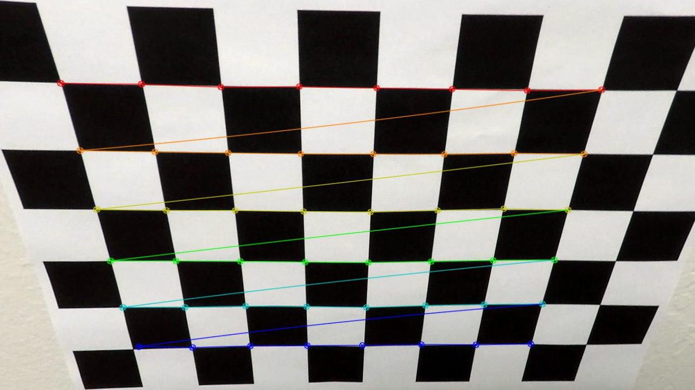
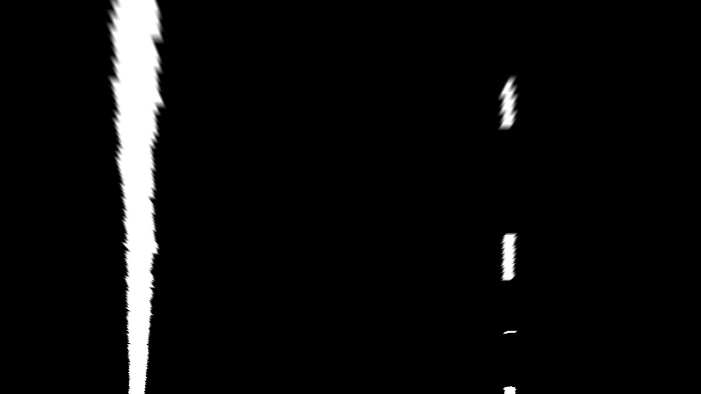
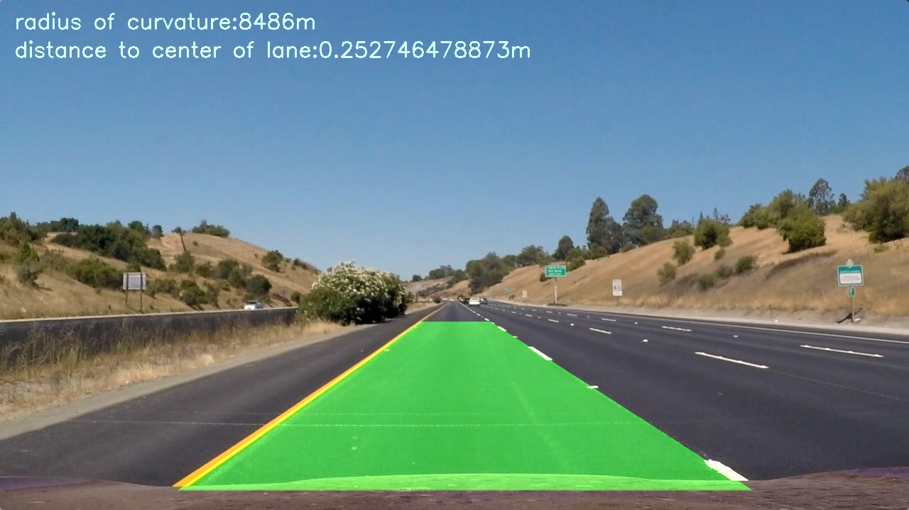

# **Advanced Lane Finding Project**

The goals / steps of this project are the following:

* Compute the camera calibration matrix and distortion coefficients given a set of chessboard images.
* Apply a distortion correction to raw images.
* Use color transforms, gradients, etc., to create a thresholded binary image.
* Apply a perspective transform to rectify binary image ("birds-eye view").
* Detect lane pixels and fit to find the lane boundary.
* Determine the curvature of the lane and vehicle position with respect to center.
* Warp the detected lane boundaries back onto the original image.
* Output visual display of the lane boundaries and numerical estimation of lane curvature and vehicle position.


Source Code: <a href="./advanced_lane_finding.py" target="_blank">advanced\_lane\_finding.py</a>


## [Rubric](https://review.udacity.com/#!/rubrics/571/view) Points

#### Here I will consider the rubric points individually and describe how I addressed each point in my implementation.  

---

## Camera Calibration

To calibrate the camera and correct for distortion, I used OpenCV's 'findChessboardCorners' function to locate the chessboard corners on many images of chessboard at different angles and distances.

The related code is contained in lines 6-20 of advanced\_lane\_finding.py. Here the 'calibrate' function is defined which will create lists of image points (detected chessboard corners) and object points (chessboard corners destination locations after calibration for distortion).

<center><table>
  <tr>
    <th>Distorted Chessboard</th>
	<th>Marked Corners Chessboard</th>
  </tr>
  <tr>
    <td></td>
    <td></td>
  </tr>
</table></center>

The calibration images are processed by this function in the code from lines 22-28. This function undistorts images according to the transformation discovered by 'calibrate'.

<center><table>
  <tr>
    <th>Distorted Chessboard</th>
	<th>Undistorted Chessboard</th>
  </tr>
  <tr>
    <td></td>
    <td></td>
  </tr>
</table></center>

Notice how the lines between the corners have straightened, indicating successful calibration.

---

## Pipeline (single images)

### Distortion Correction

The code from lines 38 to 57 then load the test images and undistort them, saving the results in a new folder.

<center><table>
  <tr>
    <th>Distorted Test Image</th>
	<th>Undistorted Test Image</th>
  </tr>
  <tr>
    <td></td>
    <td></td>
  </tr>
</table></center>

It may be hard to tell the difference, as the distortion is minor and increases in intensity outward from the center of the image. Notice, however, the location of the sign on the right side of the image and how it moves when the camera distortion is removed.

### Colorspace Thresholding

I used a combination of different colorspace thresholds to create a binary image that will pick out the lane lines with minimal noise. The threshold functions are defined from lines 60-79. They allow for custom input of minimum and maximum thresholds on a per space basis. In particular, I found using the 'L' dimension of the 'Luv' colorspace, the 'b' dimension of the 'Lab' colorspace, red, and grayscale in combination with a maximum blue value to work well.

The combined thresholding function is from lines 93-103. It combines the thresholded colorspaces and returns a binary image.

Lines 91-98 apply the thresholding to the undistorted test images and write the thresholded images to a new folder. Below is an example of the thresholding in action:

<center><table>
  <tr>
    <th>Undistorted Test Image</th>
	<th>Thresholded Undistorted Test Image</th>
  </tr>
  <tr>
    <td></td>
    <td></td>
  </tr>
</table></center>

### Perspective Transform

In order to perform a perspective transformation to get a top-down view of the road, source points were manually found from a test image with straight lane lines and destination points were created to make the lines straight as well as to have the section of road occupy most of the image.

This resulted in the following source and destination points found on lines 103-104:

| Source        | Destination   | 
|:-------------:|:-------------:| 
| 246, 693      | 250, 720      | 
| 585, 458      | 250, 100      |
| 698, 458      | 930, 100      |
| 1061, 693     | 930, 720      |

Below is an example of a 'warped' image after the perspective transformation:

<center><table>
  <tr>
    <th>Before Perspective Transformation</th>
	<th>After Perspective Transformation</th>
  </tr>
  <tr>
    <td></td>
    <td></td>
  </tr>
</table></center>

### Fitting Polynomials to Draw Lane Boundaries

To find the portions of the warped and thresholded images that represented the lane lines, I used a convolution to find the location of the signal with the highest overlap between a matrix of 1s and the warped image (find_window_centroids function, line 137). This location was designated as the centroid of a window with predefined dimensions, one for each side of the image. If no such centroid was found for any of the 9 vertical levels of the image used in this 'sliding windows' approach, then the centroid for that level was set to be the centroid of the previous level plus the difference between the previous centroid and the centroid prior to that in order to continue the trend (lines 176-191):

```python
        offset = window_width / 2
        l_min_index = int(max(l_center - offset - margin, 0))
        l_max_index = int(min(l_center - offset + margin, warped.shape[1]))
        if conv_signal[l_min_index:l_max_index].any():
            l_center = np.argmax(conv_signal[l_min_index:l_max_index]) + l_min_index - offset
        # if none found, repeat linear trend from last 2 windows
        elif len(left_lane_cent_x) > 1:
            l_center = left_lane_cent_x[level - 2] - left_lane_cent_x[level - 3] + l_center
        # Find the best right centroid by using past right center as a reference
        r_min_index = int(max(r_center + offset - margin, 0))
        r_max_index = int(min(r_center + offset + margin, warped.shape[1]))
        if conv_signal[r_min_index:r_max_index].any():
            r_center = np.argmax(conv_signal[r_min_index:r_max_index]) + r_min_index - offset
        # if none found, repeat linear trend from last 2 windows
        elif len(right_lane_cent_x) > 1:
            r_center = right_lane_cent_x[level - 2] - right_lane_cent_x[level - 3] + r_center
```

Then, nonzero pixels inside this window were designated as points that constitute the lane line (lines 193-206). The left and right lane indices were each concatenated and returned by the 'find_window_centroids' function along with the centroids.

These points were then used to fit a second degree polynomial for each lane line (lines 227-247), as well as to draw the polygon formed by the two polynomials and fill it (lines 265-275), reverse perspective transform it (line 276), and return it to be layer on top of the original image (line 278).

### Radius of Curvature

To calculate the radius of curvature of the turn, we first have to convert the xy pixelspace back into something representative of reality; meters. To do this we estimate the conversion ratios based on US standards for lane dimensions and dashed lane line length, giving us the ratios found at lines 252-253.

```python
ym_per_pix = 31 / 620 # meters per pixel in y dimension
xm_per_pix = 3.7 / 710 # meters per pixel in x dimension
```

New 2nd degree polynomial functions are then fitted to the points after conversion to meters (lines 256-257).

```python
left_fit_cr = np.polyfit(left_y * ym_per_pix, left_x * xm_per_pix, 2)
right_fit_cr = np.polyfit(right_y * ym_per_pix, right_x * xm_per_pix, 2)
```
	
Then the radii of curvature for left and right lane lines are calculating using the second derivative of the polynomial function (lines 259-260).

```python
left_curverad = ((1 + (2 * left_fit_cr[0] * y_val * ym_per_pix + left_fit_cr[1]) ** 2) ** 1.5) / np.absolute(2 * left_fit_cr[0])
right_curverad = ((1 + (2 * right_fit_cr[0] * y_val * ym_per_pix + right_fit_cr[1]) ** 2) ** 1.5) / np.absolute(2 * right_fit_cr[0])
```

Finally, the determined radii are averaged to calculate the approximate radius of curvature of the lane (line 263).

```python
avg_curve_rad = int((left_curverad + right_curverad) / 2)
```

This radius of curvature is drawn as well formatted text onto the lane fill layer by the line 277. Later this layer is overlayed on the original image as previously explained.

### Results

The entire pipeline takes a distorted, unthresholded image of the road and returns the same image with the lane clearly highlighted in green, as well as a report of the instantaneous radius of curvature in white text.

<center><table>
  <tr>
    <th>Original Image</th>
	<th>After Processing</th>
  </tr>
  <tr>
    <td></td>
    <td></td>
  </tr>
</table></center>

The toughest of the test images was test4.jpg due to the shadows and changing color of the road. Here are the results:

<center><table>
  <tr>
    <th>Original Image</th>
	<th>After Processing</th>
  </tr>
  <tr>
    <td></td>
    <td></td>
  </tr>
</table></center>

---

### Pipeline (video)

I used a object design for my video pipeline in order to easily track data across frames (lines 312-329). This way I was able to track previous starting centroids (at the bottom of the screen) as well as variable terms of the polynomial used to fit the curves. I decided to compute a running average of the polynomial terms for 3 frames. The results can be seen in the video [here](./output_images/project_video_output):

<iframe width="560" height="315" src="https://www.youtube.com/embed/R_FcAb1cqoY" frameborder="0" allowfullscreen></iframe>
<br>

---

### Discussion

While this pipeline does a good job of detecting lane lines on a fairly flat, relatively straight surface in daylight, it has yet to be tested properly in many different conditions. It's likely that the threshold values will have to change to acomodate night time situations, or otherwise poorly lit situations. Additionally, it's possible that if the curve is very sharp the detection may fail.

In order to make it more robust I would experiment with videos from many different conditions. I would possibly need to move the source points for the perspective transformation closer together as well to allow for very sharp curves to be completely displayed within the image.